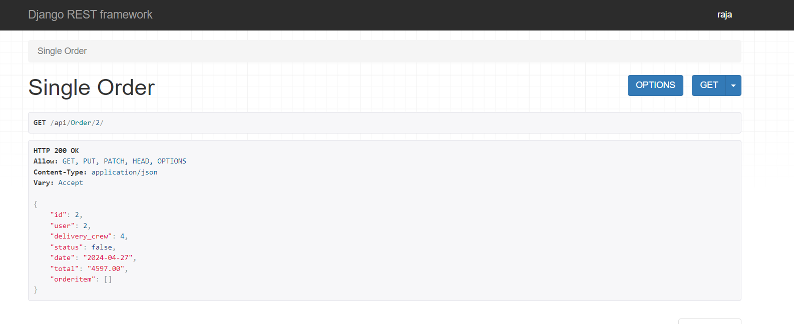

# Ecommerce Project API

This project is an ecommerce API with various features for admins, managers, delivery crew, and customers.

## Installation

### Install Pipenv

Pipenv is a tool that aims to bring the best of all packaging worlds to the Python world. It harnesses Pipfile, pip, and virtualenv into one single command. Here's how you can install it:

```bash
pip install pipenv
```

### Activate virtual environment
```bash
pipenv shell
```

### Install Django and Django Rest Framework
With your Pipenv environment activated, you can install Django and Django Rest Framework:
```bash
pipenv install django djangorestframework
```

## API Endpoints
```bash
/api/categories/ (GET, POST): Endpoint for retrieving and creating categories.
/api/Menu-Items/ (GET, POST): Endpoint for retrieving and creating menu items.
/api/MenuItem/<int:pk>/ (GET, PUT, DELETE): Endpoint for retrieving, updating, and deleting a specific menu item.
/api/Cart/ (GET, POST): Endpoint for retrieving and creating items in the cart.
/api/Orders/ (GET, POST): Endpoint for retrieving and creating orders.
/api/Order/<int:pk>/ (GET, PUT, DELETE): Endpoint for retrieving, updating, and deleting a specific order.
/api/groups/manager/users (GET, POST, DELETE): Endpoint for listing, creating, and deleting users in the manager group.
/api/groups/delivery-crew/users (GET, POST, DELETE): Endpoint for listing, creating, and deleting users in the delivery crew group.
```

## Features
### Admin Features
Assign users to the manager group.
Add menu items.
Add categories.
### Manager Features
Log in.
Update the item of the day.
Assign users to the delivery crew.
Assign orders to the delivery crew.
### Delivery Crew Features
Access orders assigned to them.
Update an order as delivered.
### Customer Features
Register.
Log in using their username and password and get access tokens.
Browse all categories.
Browse all the menu items at once.
Browse menu items by category.
Paginate menu items.
Sort menu items by price.
Add menu items to the cart.
Access previously added items in the cart.
Place orders.
Browse their own orders.


## Insomnia Testing
Here are the screenshots of the API endpoints tested in Insomnia and in Browser:

#### Creating category using Admin token


#### Creating category using non-admin or non-staff token


#### Listing menu items -> GET method


#### Creating menu-items using admin token -> POST method


#### Retriving single order


#### Listing all orders
